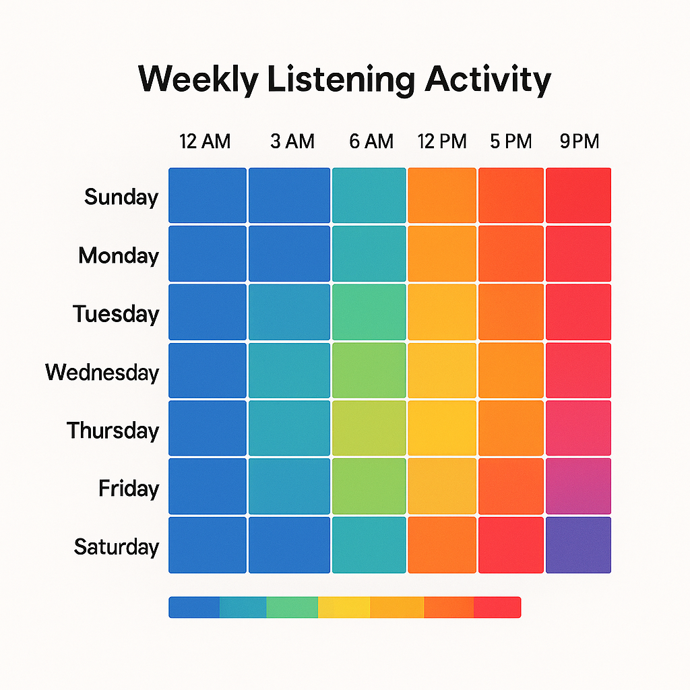

# 🎶 Sonify

Sonify is a Spotify Data Visualizer that connects to your Spotify account and generates beautiful, shareable visualizations of your listening habits. From heatmaps of your daily listening times to genre breakdowns and mood-based playlist insights — Sonify turns your data into art.

## 🚀 Features

- 🔥 **Listening heatmaps** — Discover when you listen most, visualized in stylish heatmaps.
- 🎨 **Genre & artist breakdowns** — See your top genres, artists, and tracks in vibrant charts.
- 😎 **Mood-based playlist insights** — Analyze and share the vibe of your playlists.
- 📤 **Share-ready exports** — Download or share your data visualizations on social media.

## 🛠 Tech Stack

- **Python** + [Spotipy](https://spotipy.readthedocs.io/en/2.22.1/) — Spotify Web API integration
- **Flask** — Lightweight web server
- **Plotly / D3.js** — Interactive and beautiful visualizations

## 🌟 Why Sonify?

While some Spotify visualizers exist, Sonify focuses on *aesthetic* insights that are perfect for sharing. Whether you're a music enthusiast or a marketer analyzing listener trends, Sonify helps you see your music data in a whole new way.

## 📸 Sample Visualization



## 🏁 Getting Started

1️⃣ **Clone the repo**
```bash
git clone https://github.com/makalin/Sonify.git
cd Sonify
````

2️⃣ **Install dependencies**

```bash
pip install -r requirements.txt
```

3️⃣ **Set up Spotify credentials**

Create a `.env` file:

```
SPOTIPY_CLIENT_ID=your_client_id
SPOTIPY_CLIENT_SECRET=your_client_secret
SPOTIPY_REDIRECT_URI=http://localhost:5000/callback
```

Register your app at [Spotify Developer Dashboard](https://developer.spotify.com/dashboard/applications).

4️⃣ **Run the app**

```bash
flask run
```

Visit `http://localhost:5000` in your browser.

## 📌 Roadmap

* [ ] Add support for audio feature clustering
* [ ] Custom color themes for visualizations
* [ ] Multi-user dashboard

## 💌 Contributing

Pull requests welcome! For major changes, please open an issue first to discuss what you would like to change.

## 📄 License

MIT

---

**Sonify — Your music, visualized.**
